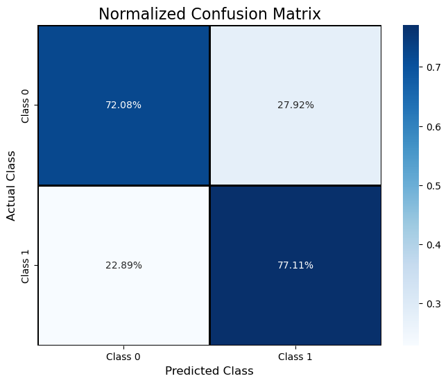
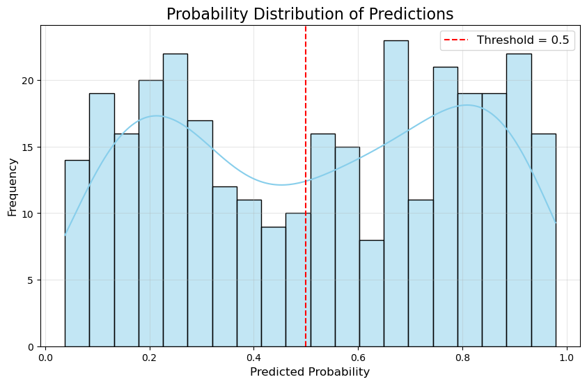
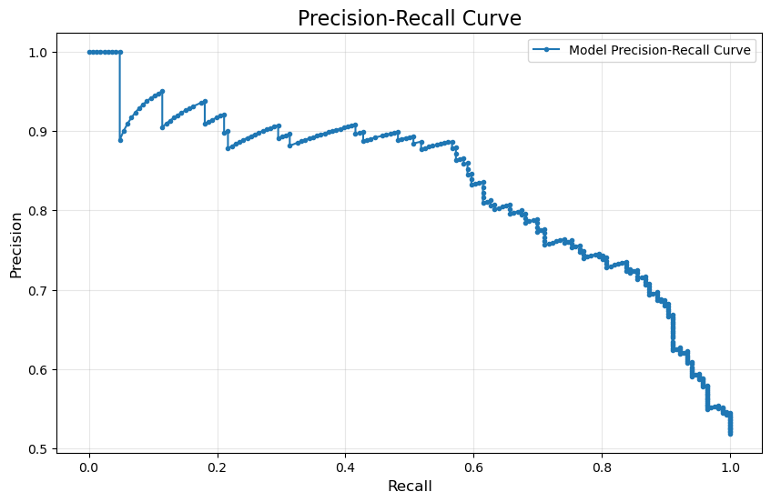
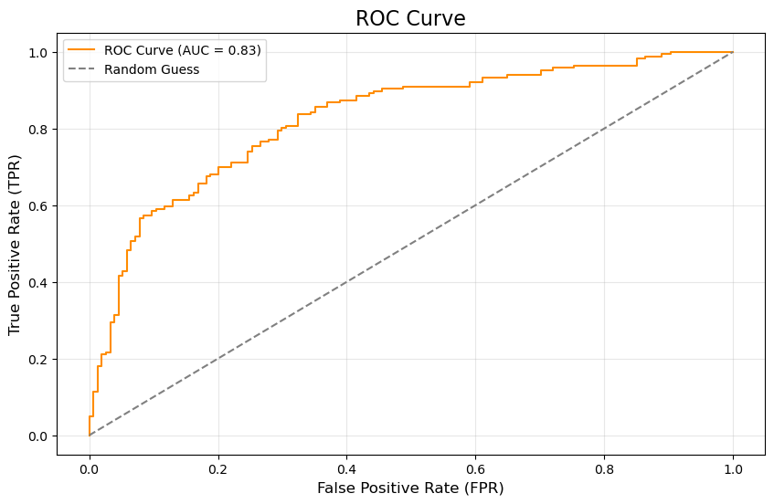
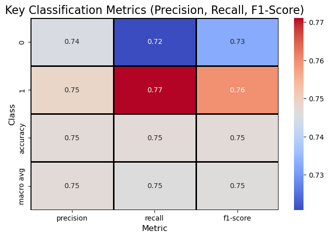
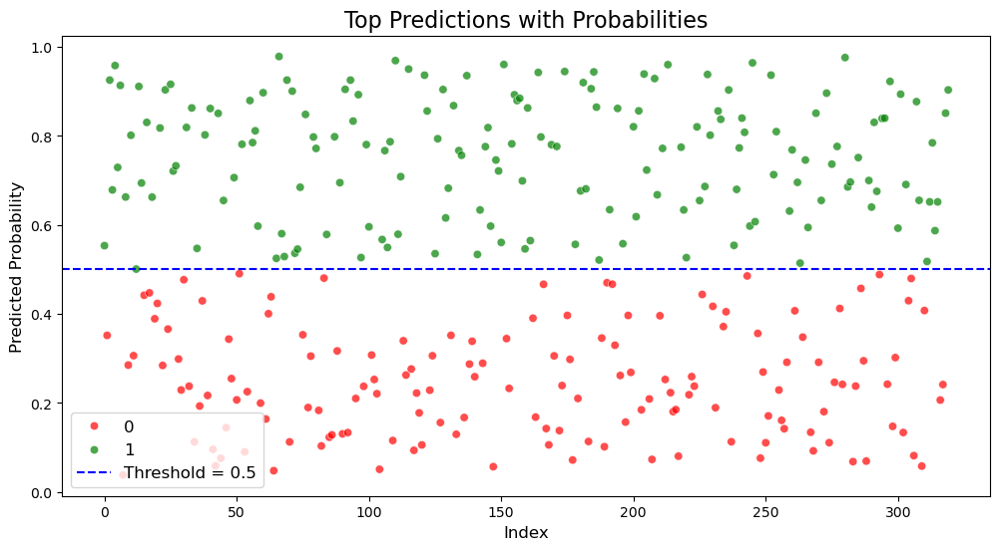

# Loan Repayment Prediction Model

## Purpose
The **Loan Repayment Prediction Model** is a machine learning solution that predicts whether a borrower will repay their student loan. By leveraging Python, TensorFlow, and other data analysis libraries, the project provides actionable insights into borrower risk, enabling financial institutions to make data-driven lending decisions. 

This project demonstrates how machine learning can assist businesses in managing financial risk, optimizing loan strategies, and enhancing profitability. The model and analysis simulate a real-world lending scenario, allowing for practical application of predictive analytics.

---

## Overview
The **Loan Repayment Prediction Model** addresses key business objectives:
- Assess borrower repayment likelihood to improve risk management.
- Identify trends in loan default rates to mitigate financial losses.
- Enhance profitability by optimizing loan terms for reliable borrowers.
- Improve customer experience by offering tailored loan options.

Using neural networks and advanced visualizations, the project analyzes borrower data and provides key insights into trends, risks, and performance metrics.

---

## Table of Contents

1. [Purpose](#purpose)  
2. [Overview](#overview)  
3. [Data Dictionary](#data-dictionary)  
4. [Project Structure](#project-structure)  
5. [Visualizations](#visualizations)  
   - [Normalized Confusion Matrix](#normalized-confusion-matrix)  
   - [Probability Distribution of Predictions](#probability-distribution-of-predictions)  
   - [Precision-Recall Curve](#precision-recall-curve)  
   - [ROC Curve](#roc-curve)  
   - [Classification Metrics Heatmap](#classification-metrics-heatmap)  
   - [Top Predictions Visualization](#top-predictions-visualization)  
6. [Use Cases](#use-cases)  
7. [Technologies Used](#technologies-used)  
8. [Installation and How to Use](#installation-and-how-to-use)  
9. [Recommendations](#recommendations)  
10. [Future Considerations](#future-considerations)  
11. [Conclusion](#conclusion)  


---

## Data Dictionary

The dataset contains the following columns:

| Column             | Data Type  | Description                                              |
|--------------------|------------|----------------------------------------------------------|
| `credit_ranking`   | int64      | Target variable: 1 for repayment, 0 for default.         |
| `payment_history`  | float64    | Historical credit behavior score.                        |
| `location_parameter` | float64  | Location-based economic indicator.                       |
| `stem_degree_score` | float64   | Score indicating value of the borrower’s STEM degree.    |
| `gpa_ranking`      | float64    | GPA score ranking of the borrower.                      |
| `time_to_completion` | float64  | Time taken to complete education (in years).            |
| `financial_aid_score` | float64 | Score representing financial aid received.              |

### Dataset Summary
- **Row Count**: 1,599 entries
- **Memory Usage**: ~150 KB
- **Non-null Count**: All columns have 1,599 non-null entries
- **Data Types**: A mix of object (string) and numerical (float64, int64)

---

## Project Structure

The project includes the following:

- **models/**: Contains the trained neural network model (`student_loans.keras`).  
- **notebooks/**: Includes the main Jupyter notebook for analysis and training (`student_loans_with_deep_learning.ipynb`).  
- **images/**: Includes all visualizations created during the analysis.  
- **README.md**: This documentation file.

---

## Visualizations

### 1. Normalized Confusion Matrix
  
- **Purpose**: Highlights the classification accuracy and misclassification rates.  
- **Business Insight**: Identifies areas to refine thresholds for better risk management.

---

### 2. Probability Distribution of Predictions
  
- **Purpose**: Shows the distribution of predicted probabilities.  
- **Business Insight**: Identifies borderline cases for additional evaluation.

---

### 3. Precision-Recall Curve
  
- **Purpose**: Visualizes the trade-off between precision and recall.  
- **Business Insight**: Helps determine the balance between false positives and false negatives.

---

### 4. ROC Curve
  
- **Purpose**: Measures the model’s ability to differentiate between repayment and default.  
- **Business Insight**: Demonstrates strong model performance with an AUC of 0.83.

---

### 5. Classification Metrics Heatmap
  
- **Purpose**: Summarizes key performance metrics (precision, recall, F1-score).  
- **Business Insight**: Guides targeted improvements for each borrower group.

---

### 6. Top Predictions Visualization
  
- **Purpose**: Highlights cases near the classification threshold.  
- **Business Insight**: Supports improved decision-making for borderline borrowers.

---

## Use Cases

This project addresses key business objectives, including:
1. **Risk Management**: Identifies high-risk borrowers likely to default.  
2. **Profitability**: Maximizes revenue by accurately classifying borrowers.  
3. **Customer Retention**: Offers tailored loan options to improve borrower satisfaction.  

---

## Technologies Used

- **Python**: For data manipulation, analysis, and modeling.
- **TensorFlow/Keras**: For building and training the neural network model.
- **Pandas**: For data exploration and preprocessing.
- **Matplotlib/Seaborn**: For creating visualizations.
- **scikit-learn**: For evaluation metrics and scaling features.
- **Pathlib**: For flexible file path handling.

---

## Installation and How to Use

### Installation Steps

1. **Clone this repository to your local machine:**

   ```bash
   git clone https://github.com/jsaintfleur/neural-network-challenge-1.git
    ```

2. **Navigate to the Project Directory:**
```bash
   cd neural-network-challenge-1
```

3. **Install Dependencies: Install the required Python libraries by running:**

```python
# Import Libraries

import pandas as pd  # Data manipulation and analysis
import numpy as np  # Numerical computations and array handling
import seaborn as sns  # Statistical visualizations
import matplotlib.pyplot as plt  # General visualizations

# TensorFlow and Keras for deep learning
import tensorflow as tf
from tensorflow.keras.layers import Dense  # Fully connected neural network layer
from tensorflow.keras.models import Sequential  # Sequential model for neural networks

# Scikit-learn for preprocessing, evaluation, and metrics
from sklearn.model_selection import train_test_split  # Splitting dataset into training and testing sets
from sklearn.preprocessing import StandardScaler  # Feature scaling
from sklearn.metrics import (classification_report, confusion_matrix, roc_curve, 
                              auc, precision_recall_curve)  # Model evaluation metrics

from pathlib import Path  # Path handling

```

4. **Launch the Jupyter Notebook: Open the project analysis notebook:**

``` bash
jupyter notebook
```
5. **Run the Analysis:** 
Open the `student_loans_with_deep_learning.ipynb` notebook and run the cells to view the analysis and visualizations.


**Prerequisites**
- Python 3.8 or higher
- Jupyter Notebook or JupyterLab
- A web browser to view the notebook

---

## Technologies Used
- **Python**: For data manipulation and analysis.
- **Pandas**: For data exploration, transformation, and aggregation.
- **Matplotlib & Seaborn**: For creating visualizations.
- **Jupyter Notebook**: For conducting and presenting the analysis.
- **Git/GitHub**: For version control and sharing the project.

## Recommendations
The analysis reveals several recommendations for financial institutions and stakeholders:

1. **Enhanced Borrower Profiling**: Incorporate additional features such as employment stability, income levels, and prior debt history to improve prediction accuracy and identify reliable borrowers.

2. **Adaptive Lending Strategies**: Leverage the model's predictions to tailor loan offerings based on borrower risk levels:
   - Offer competitive interest rates to high-probability repayers.
   - Implement stricter lending criteria or higher interest rates for higher-risk borrowers.

3. **Threshold Optimization**: Adjust the classification threshold to align with business objectives:
   - Lower thresholds to increase approvals and maximize customer retention.
   - Higher thresholds to minimize defaults and reduce financial risk.

4. **Focus on Edge Cases**: Analyze borderline cases near the classification threshold for deeper insights into decision-making, especially for borrowers with repayment probabilities close to 50%.

5. **Continuous Model Improvement**: Regularly retrain and validate the model using new borrower data to ensure it remains relevant and effective as market conditions change.

6. **Risk Mitigation Campaigns**: Use predictions to proactively engage high-risk borrowers with financial literacy programs or counseling to reduce default rates.

---

## Conclusion
The **Loan Repayment Prediction Model** demonstrates the transformative potential of machine learning in the financial industry. By analyzing borrower data and predicting repayment likelihood, the model provides actionable insights that can:
- **Improve Risk Management**: Identify high-risk borrowers and minimize default rates.
- **Enhance Profitability**: Offer better loan terms to reliable borrowers and optimize revenue.
- **Support Strategic Decision-Making**: Enable data-driven decisions regarding loan approval, interest rate adjustments, and borrower segmentation.

Through its robust performance and insightful visualizations, this project highlights how data-driven approaches can empower financial institutions to refine their lending strategies, improve customer satisfaction, and achieve sustainable growth.


--- 

## Future Considerations
To further enhance the model and its business impact, future iterations of this project should explore the following:

1. **Feature Expansion**:
   - Incorporate additional borrower-specific data such as:
     - Employment history and industry type.
     - Debt-to-income ratio.
     - Historical repayment patterns from other loans.
   - Include external economic factors like inflation rates, unemployment trends, and regional economic indicators.

2. **Dynamic Threshold Adjustments**:
   - Develop an adaptive system for dynamically adjusting classification thresholds based on market conditions or business priorities.
   - Implement thresholds tailored to specific borrower segments (e.g., younger borrowers, first-time borrowers).

3. **Integration with Business Operations**:
   - Embed the model into existing lending platforms for real-time risk assessment during loan application reviews.
   - Utilize predictions to enhance customer retention through personalized loan terms or repayment reminders.

4. **Advanced Model Architectures**:
   - Explore ensemble learning methods (e.g., Random Forest, Gradient Boosting) for potentially improved predictive accuracy.
   - Experiment with deep learning architectures like Convolutional Neural Networks (CNNs) or Recurrent Neural Networks (RNNs) for handling sequential or unstructured data.

5. **Explainability and Transparency**:
   - Develop explainable AI (XAI) techniques to interpret model predictions and ensure trust among stakeholders.
   - Provide detailed explanations for individual borrower classifications, improving acceptance of model recommendations.

6. **Scalability and Deployment**:
   - Build APIs to deploy the model for large-scale, real-time usage in enterprise environments.
   - Incorporate cloud-based solutions to handle larger datasets and enable faster computations.

7. **Ongoing Monitoring and Updates**:
   - Continuously monitor model performance to identify drift or outdated assumptions.
   - Retrain the model regularly using updated borrower data and market trends to maintain accuracy and relevance.

8. **Ethical Considerations**:
   - Ensure the model avoids bias against specific demographics or socioeconomic groups.
   - Implement fairness metrics to measure and improve the equity of predictions.

By addressing these future considerations, the model can evolve into a more robust, scalable, and impactful solution that aligns with both short-term and long-term business goals.


[↩️](#table-of-contents)  